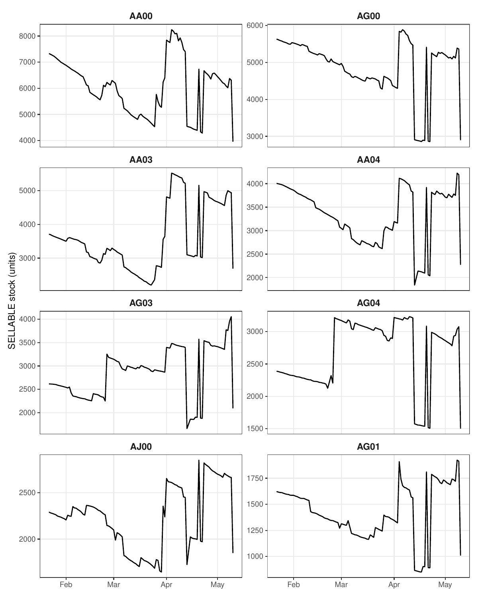
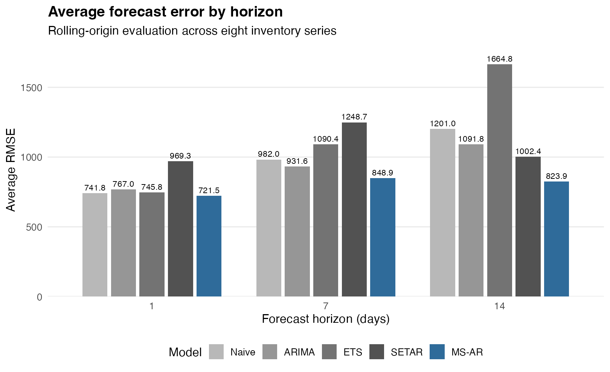
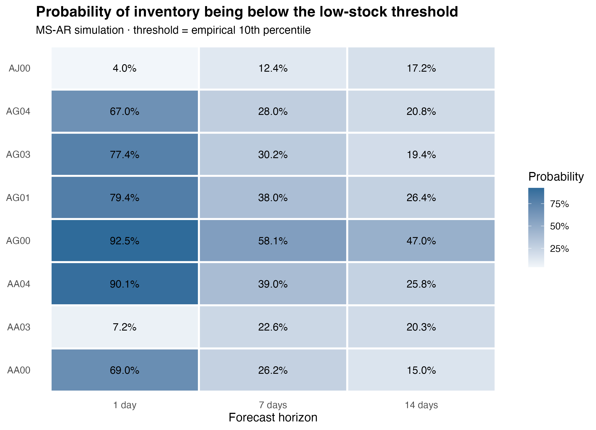

# Regime-Switching Dynamics in E-commerce Inventory

MSc Applied Econometrics & Forecasting project investigating whether nonlinear and regime-switching time-series models can improve daily inventory forecasting and provide probabilistic measures of low-stock risk using Amazon FBA inventory data.

**Full dissertation:** [Regime-Switching Dynamics in E-commerce Inventory: Evidence from Amazon FBA Daily Ledger Data](docs/dissertation.pdf)

## Research motivation

Inventory levels do not necessarily evolve according to a single stable process. Unlike a conventional demand or sales series, observed stock reflects the interaction of sales, replenishment, warehouse movements and inventory adjustments. Periods of gradual depletion can therefore be interrupted by abrupt increases or decreases in available inventory, while periods of limited stock movement may alternate with periods of much stronger variation.

This pattern is visible in the daily inventory series examined in this study. Stock levels often evolve persistently for a period and are then interrupted by sharp movements consistent with replenishment or other inventory adjustments. These features raise the question of whether a single linear dynamic is sufficient to represent the process, or whether allowing the dynamics to change across regimes provides additional forecasting value.

This motivates an empirical comparison between conventional linear forecasting approaches and regime-switching alternatives, rather than assuming nonlinear dynamics a priori.

The central research question is:

> **Can regime-dependent dynamics in daily inventory levels improve multi-horizon forecasting and provide useful probabilistic measures of low-stock risk?**

The analysis addresses this question from three connected perspectives:

1. **Inventory dynamics:** is there evidence that the observed inventory series exhibit nonlinear or regime-dependent behaviour?
2. **Forecasting:** do regime-switching models improve out-of-sample forecasts relative to linear and naive benchmarks, and does their relative performance change with the forecast horizon?
3. **Operational risk:** can the estimated regime dynamics be translated into probabilities of low inventory at future horizons?

The objective is therefore not simply to identify a single winning forecasting model, but to test whether explicitly allowing inventory dynamics to change across regimes provides useful information for both point forecasting and inventory-risk assessment.

## Data

The study uses daily inventory ledger data obtained through the Amazon Seller Partner API (SP-API) for a seller operating under the Fulfilment by Amazon (FBA) programme.

Only `SELLABLE` inventory is analysed. The original ledger records inventory by product, fulfilment-centre location and date; these observations are aggregated across locations to obtain total daily sellable stock for each Master SKU.

The original dataset contains 36 Master SKUs. Eight series were selected based on complete daily coverage, positive and economically meaningful stock levels, and sufficient time-series variation for model estimation. Product identities are anonymized.

Each selected SKU contains **108 daily observations**, covering the period from **22 January to 10 May 2026**.

Raw operational data are proprietary and are therefore not distributed in this repository.

## Inventory dynamics

The eight selected inventory series display heterogeneous dynamics. Several trajectories combine persistent movements with abrupt changes in stock levels, providing the empirical motivation for testing models that allow different dynamic regimes.



Stationarity is assessed using ADF, KPSS and Phillips-Perron tests, while the Tsay test is used to investigate nonlinearity. In the post-dissertation revision, the Tsay test rejects linearity at the 5% level for **5 of the 8 SKUs**.

These diagnostics provide a basis for testing regime-switching specifications, but do not imply that the observed movements necessarily correspond to known operational states. The regimes identified by the models are statistical rather than directly observed operational states.

With additional event-level information on replenishments, sales activity or inventory adjustments, a natural extension would be to investigate whether estimated regime transitions systematically correspond to observable operational events.

## Empirical strategy

Five forecasting approaches are compared:

- **Naive**, as a persistence benchmark;
- **ARIMA**, representing conventional linear autoregressive forecasting;
- **ETS**, representing exponential-smoothing dynamics;
- **SETAR**, allowing observable threshold-dependent autoregressive regimes;
- **MS-AR**, allowing two latent regimes governed by a Markov process.

Forecast performance is evaluated through expanding-window rolling-origin validation at horizons of **1, 7 and 14 days**, producing 24 SKU-horizon evaluation cases.

Two complementary accuracy metrics are used. **RMSE** places greater weight on large forecast errors, while **MASE** evaluates forecast accuracy relative to an in-sample naive benchmark and allows comparison across inventory series with different scales.

Average forecast accuracy alone does not establish statistical superiority. The analysis therefore also uses **Diebold-Mariano tests** for pairwise predictive-accuracy comparisons and the **Model Confidence Set** procedure to evaluate which models remain statistically compatible with the best-performing model.

Finally, the fitted MS-AR dynamics are used for Monte Carlo simulation. For each SKU, **2,000 possible inventory paths over 14 days** are generated and used to estimate horizon-specific low-stock probabilities.

## Forecasting results

The out-of-sample results provide evidence in favour of MS-AR, particularly when forecast performance is evaluated using RMSE.



Across the eight inventory series, MS-AR achieves the lowest average RMSE at all three forecast horizons: **721.5 at 1 day, 848.9 at 7 days, and 823.9 at 14 days**. It also records the lowest RMSE in **17 of the 24 SKU-horizon cases**, compared with 4 wins for ARIMA, 2 for SETAR, 1 for ETS and none for the Naive benchmark.

The picture is less uniform under MASE. The Naive benchmark records the largest number of MASE wins, with **11 of 24 cases**, while MS-AR records 6. This is consistent with the strong persistence of the inventory series: when stock changes relatively slowly, the most recently observed inventory level can be a difficult benchmark to outperform.

The difference between the two metrics is informative. RMSE penalises large forecast errors more heavily, making it particularly sensitive to abrupt stock movements. The strong RMSE performance of MS-AR is therefore consistent with the hypothesis that allowing inventory dynamics to change across regimes can help accommodate some of these movements. It does not, however, establish that regime-switching models are uniformly superior.

Formal forecast-comparison tests provide a more cautious picture. Diebold-Mariano tests identify statistically significant improvements for MS-AR in only three one-day comparisons: AA00 against ETS, and AG04 against ARIMA and ETS. No statistically significant advantage is detected at the 7- or 14-day horizons.

The Model Confidence Set results nevertheless show strong robustness: MS-AR is retained in **all 23 valid historical MCS exercises**. This means that MS-AR is consistently compatible with the set of best-performing models, rather than demonstrating that it statistically dominates every alternative.

Taken together, the results favour MS-AR under RMSE while showing that simpler models remain competitive under other evaluation criteria. The evidence therefore supports the usefulness of regime-dependent dynamics without implying that nonlinear models should replace linear or naive approaches in every case.

The evaluation is based on relatively short inventory histories of 108 daily observations per SKU. A longer observation window would allow a stronger assessment of whether the relative forecasting performance remains stable across different replenishment cycles and operating conditions.

## From forecasting to low-stock risk

Point forecasts describe the expected future evolution of inventory, but they do not directly quantify the uncertainty surrounding that forecast. The fitted MS-AR models are therefore also used to simulate possible future inventory trajectories and translate the estimated dynamics into horizon-specific measures of low-stock risk.

For each SKU, **2,000 inventory paths over a 14-day horizon** are simulated from the fitted MS-AR model.

Low-stock thresholds are defined separately for each SKU using its empirical inventory distribution. The empirical 10th percentile is used as the main specification, with the 5th and 20th percentiles used as robustness checks.

The figure below reports the probability that inventory is **below the SKU-specific 10th-percentile threshold at each forecast horizon**.



These are horizon-specific probabilities:

$$
P(X_{i,t+h} < q_{i,0.10})
$$

They should not be interpreted as the cumulative probability of crossing the threshold at any point before horizon $h$.

The simulations reveal substantial heterogeneity across SKUs and horizons. For example, AG00 has a high estimated probability of being below its low-stock threshold at the one-day horizon (**92.5%**), remaining elevated at 7 and 14 days (**58.1%** and **47.0%**). By contrast, AJ00 has a low immediate probability (**4.0%**) that increases at longer horizons (**12.4%** at 7 days and **17.2%** at 14 days).

AA00 illustrates another pattern: the estimated probability is high at the one-day horizon (**69.0%**) but falls to **26.2%** at 7 days and **15.0%** at 14 days. The simulated risk profile therefore depends not only on the SKU, but also on the forecast horizon.

The resulting probabilities measure the likelihood of each SKU being in a relatively low inventory state at a given forecast horizon. This illustrates how the forecasting framework can be extended beyond a single point prediction to characterize the distribution of possible future inventory states.

With additional operational information, the framework could be extended by replacing the empirical percentile thresholds with SKU-specific decision thresholds. These could incorporate information such as replenishment lead times, sales velocity, safety-stock requirements or reorder points, allowing the model to estimate the probability of inventory falling below an operationally defined critical level for each SKU.

## Main takeaway

The empirical evidence does not imply that nonlinear models always outperform linear alternatives.

Instead, the results show that allowing inventory dynamics to switch between regimes can be useful when stock series contain persistent behaviour together with abrupt movements. MS-AR achieves the strongest overall RMSE performance and remains in every valid historical Model Confidence Set, while the Naive benchmark remains highly competitive under MASE and formal pairwise evidence of superiority is limited.

The contribution of the analysis is therefore broader than selecting a forecasting winner. It examines whether regime-dependent dynamics provide useful predictive information and shows how the same modelling framework can be extended from multi-horizon point forecasting to probabilistic measures of future low-inventory risk.

For the complete methodology, model specifications, literature review and results, see the [full dissertation](docs/dissertation.pdf).

## Repository structure

```text
R/
  01_data_preparation.R
  02_diagnostics.R
  03_models.R
  04_forecast_evaluation.R
  05_low_stock_simulation.R
  06_figures_tables.R
  07_monte_carlo_workflow_diagram.R

data/                       # documentation only; raw data excluded
results/reference/          # anonymized historical result snapshot
figures/                    # dissertation and repository figures
tables/                     # selected final result tables
docs/
  dissertation.pdf          # full MSc dissertation
  PROVENANCE.md             # reconstruction and validation history

reproduce_public_results.R  # reproduces public outputs without raw data
validate_against_locked.R   # compares a full rerun with historical results
run_all.R                   # full pipeline; requires authorized raw data
references.bib
```

## Reproduce the public results

No proprietary data are required to inspect and export the archived dissertation results.

From the repository root:

```r
source("reproduce_public_results.R")
```

This validates the anonymized historical snapshot and exports machine-readable CSV files to `outputs/public/`.

## Run the full analytical pipeline

The full pipeline requires an authorized local copy of the original workbook. The reconstruction imports only the four variables required for the analysis from the `IL_AWD` sheet; account and mapping sheets are not used.

Set the workbook path and run:

```r
Sys.setenv(THESIS_DATA_PATH = "/path/to/authorized/workbook.xlsx")
source("run_all.R")
```

Required packages include `readxl`, `dplyr`, `purrr`, `tibble`, `tidyr`, `ggplot2`, `forecast`, `tseries`, `urca`, `tsDyn`, `MSwM`, `MCS`, and `NTS`. Diagram regeneration additionally uses `DiagrammeR`, `DiagrammeRsvg`, and `rsvg`.

After a full run, the reconstructed outputs can be compared with the historical dissertation snapshot using:

```r
source("validate_against_locked.R", local = new.env())
```

## Reproducibility and historical results

The repository distinguishes between the **historical results used in the dissertation** and the **reconstructed analytical pipeline**.

ARIMA, ETS, SETAR and Naive rolling-forecast metrics reproduce the historical results. The low-stock robustness simulation reproduces the archived results exactly, and the Tsay tests reproduce the values reported in the post-dissertation revision.

Small differences remain in rolling MS-AR estimates because `MSwM::msmFit()` uses stochastic initialization and the original workflow did not preserve the RNG state used for those historical fits. The reconstructed pipeline fixes the random seed so that future runs are deterministic. Diebold-Mariano and Model Confidence Set results can consequently inherit small differences from the reconstructed MS-AR forecasts.

The archived dissertation outputs are retained in `results/reference/thesis_results_locked.rds` for traceability and are never overwritten.

Because the original company data cannot be distributed, public reproduction starts from this anonymized historical result snapshot; full reproduction from raw data requires authorized access to the source workbook.

See [`docs/PROVENANCE.md`](docs/PROVENANCE.md) for the detailed reconstruction and validation history.