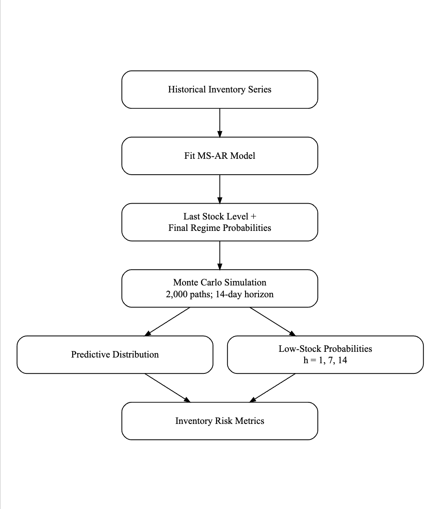
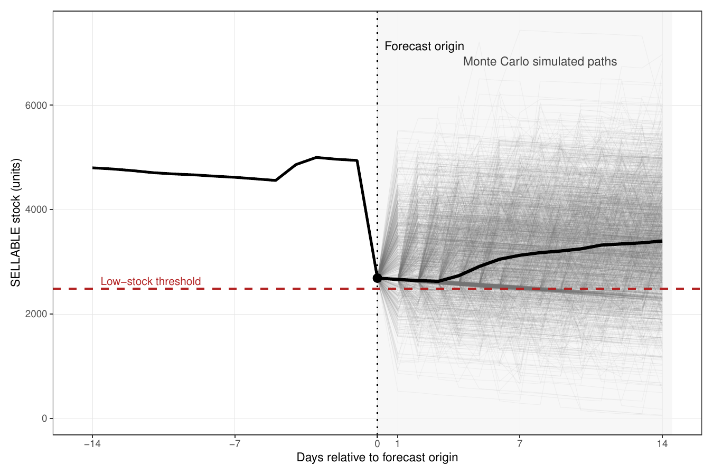

# Regime-Switching Dynamics in E-commerce Inventory

MSc Applied Econometrics & Forecasting project studying whether nonlinear and regime-switching time-series models improve inventory forecasting and low-stock risk assessment for Amazon FBA inventory series.

## Research question

Can regime-dependent dynamics in daily inventory levels improve multi-horizon forecasting and provide useful probabilistic measures of low-stock risk?

The study uses eight anonymized Master SKUs with 108 daily observations each. Raw operational data are proprietary and are therefore not distributed in this repository.

## Empirical workflow

1. Aggregate daily `SELLABLE` inventory by anonymized Master SKU.
2. Diagnose time-series properties with ADF, KPSS, Phillips-Perron and Tsay nonlinearity tests.
3. Estimate Naive, ARIMA, ETS, SETAR and two-state Markov-Switching AR(1) models.
4. Evaluate forecasts with expanding-window rolling-origin validation at horizons 1, 7 and 14 days using RMSE and MASE.
5. Compare predictive accuracy with Diebold-Mariano tests and Model Confidence Sets.
6. Simulate 2,000 MS-AR paths over 14 days and estimate low-stock probabilities under alternative inventory thresholds.



## Main results

The results below refer to the archived outputs used in the final dissertation.

- MS-AR achieved the lowest **average RMSE at all three horizons**: 721.5 (1 day), 848.9 (7 days), and 823.9 (14 days).
- Across the 24 SKU-horizon cases, MS-AR recorded **17 RMSE wins**. The Naive benchmark remained competitive under MASE, with 11 wins.
- Diebold-Mariano evidence was selective rather than universal: statistically significant improvements for MS-AR were concentrated in a small number of one-day comparisons.
- In the 23 valid Model Confidence Set exercises, MS-AR was retained in **23/23 cases (100%)**. This supports robustness, not universal statistical dominance.
- The post-dissertation Tsay test rejected linearity at the 5% level for **5 of 8 SKUs**.
- Monte Carlo simulation translated the fitted MS-AR dynamics into horizon-specific low-stock probabilities, with robustness checks using empirical 5th, 10th and 20th percentile thresholds.

## Selected outputs


An indexed comparison is available in [`figures/Stock_Trajectories_Indexed_All.png`](figures/Stock_Trajectories_Indexed_All.png).



Selected final dissertation tables are preserved in [`tables/`](tables/).

## Repository structure

```text
R/
  01_data_preparation.R
  02_diagnostics.R
  03_models.R
  04_forecast_evaluation.R
  05_low_stock_simulation.R
  06_figures_tables.R
  07_monte_carlo_workflow_diagram.R

data/                       # documentation only; raw data excluded
results/reference/          # anonymized historical result snapshot
figures/                    # selected final dissertation figures
tables/                     # selected final result tables
docs/PROVENANCE.md          # reconstruction and validation history
reproduce_public_results.R  # reproduces public outputs without raw data
validate_against_locked.R   # compares a full rerun with historical results
run_all.R                   # full pipeline; requires authorized raw data
references.bib
```

## Reproduce the public results

No proprietary data are required to inspect and export the archived dissertation results.

From the repository root:

```r
source("reproduce_public_results.R")
```

This validates the anonymized historical snapshot and exports machine-readable CSV files to `outputs/public/`.

## Run the full analytical pipeline

The full pipeline requires an authorized local copy of the original workbook. The reconstruction imports only the four variables required for the analysis from the `IL_AWD` sheet; account and mapping sheets are not used.

Set the workbook path and run:

```r
Sys.setenv(THESIS_DATA_PATH = "/path/to/authorized/workbook.xlsx")
source("run_all.R")
```

Required packages include `readxl`, `dplyr`, `purrr`, `tibble`, `tidyr`, `ggplot2`, `forecast`, `tseries`, `urca`, `tsDyn`, `MSwM`, `MCS`, and `NTS`. Diagram regeneration additionally uses `DiagrammeR`, `DiagrammeRsvg`, and `rsvg`.

After a full run, the reconstructed outputs can be compared with the historical dissertation snapshot using:

```r
source("validate_against_locked.R", local = new.env())
```

## Reproducibility and historical results

The repository distinguishes between the **historical results used in the dissertation** and the **reconstructed analytical pipeline**.

ARIMA, ETS, SETAR and Naive rolling-forecast metrics reproduce the historical results. The low-stock robustness simulation reproduces the archived results exactly, and the Tsay tests reproduce the values reported in the post-dissertation revision.

Small differences remain in rolling MS-AR estimates because `MSwM::msmFit()` uses stochastic initialization and the original workflow did not preserve the RNG state used for those historical fits. The reconstructed pipeline fixes the random seed so that future runs are deterministic. Diebold-Mariano and Model Confidence Set results can consequently inherit small differences from the reconstructed MS-AR forecasts.

The archived dissertation outputs are retained in `results/reference/thesis_results_locked.rds` for traceability and are never overwritten.

Because the original company data cannot be distributed, public reproduction starts from this anonymized historical result snapshot; full reproduction from raw data requires authorized access to the source workbook.

See [`docs/PROVENANCE.md`](docs/PROVENANCE.md) for the detailed reconstruction and validation history.